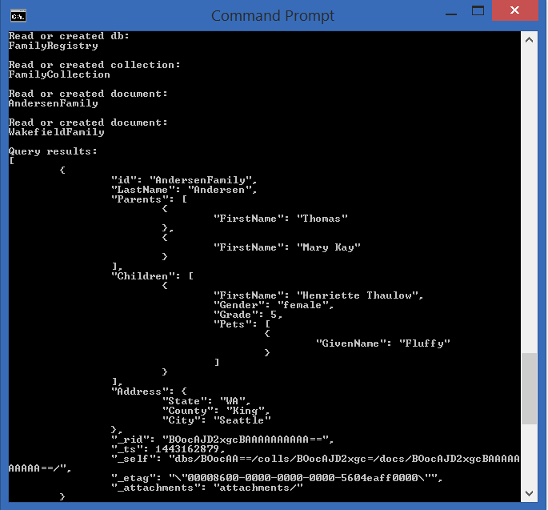

# Developing a Node.js console app using DocumentDB
This sample shows you how to use the Microsoft Azure DocumentDB service to store and access data from a Node.js console application.

## Running this sample
1. Before you can run this sample, you must have the following perquisites:
	- An active Azure DocumentDB account - If you don't have an account, refer to the [Create a DocumentDB account](https://azure.microsoft.com/en-us/documentation/articles/documentdb-create-account/) article.
	- [Node.js](https://nodejs.org/en/) version v0.10.29 or higher.
	- [Git](http://git-scm.com/).

2. Clone this repository, or download the zip file.

3. Retrieve the URI and PRIMARY KEY (or SECONDARY KEY) values from the Keys blade of your DocumentDB account in the Azure Preview portal. For more information on obtaining endpoint & keys for your DocumentDB account refer to [How to manage a DocumentDB account](https://azure.microsoft.com/en-us/documentation/articles/documentdb-manage-account/#keys).

	If you don't have an account, see [Create a DocumentDB database account](https://azure.microsoft.com/en-us/documentation/articles/documentdb-create-account/) to set one up.

4. In the **config.js** file, located in the **src** folder, find **config.endpoint** and **config.authKey** and replace the placeholder values with the values obtained for your account.

    config.endpoint = "~your DocumentDB endpoint here~";
    
    config.authKey = "~your auth key here~";

5. Run **npm install** in a terminal to install required npm modules
 
6. Run **node app.js** in a terminal to start your start your node application.

## About the code
The code included in this sample is intended to get you quickly started with a Node.js console application that connects to Azure DocumentDB.

## More information

- [Azure DocumentDB Documentation](https://azure.microsoft.com/en-us/documentation/services/documentdb/)
- [Azure DocumentDB Node SDK](https://www.npmjs.com/package/documentdb)
- [Azure DocumentDB Node SDK Reference Documentation](http://azure.github.io/azure-documentdb-node/)
